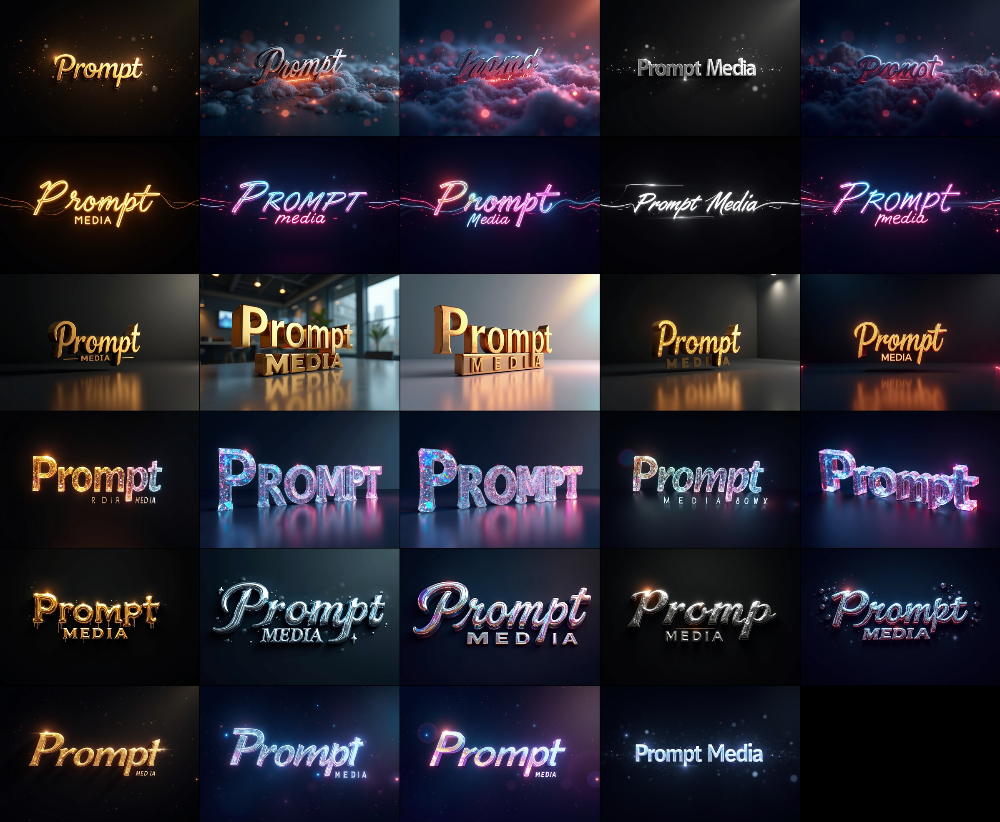

# Prompt Media

Orchestrate the creation of diverse media outputs with configurable parameters and reproducible results.

You can view our sample collections [here](https://drive.google.com/drive/folders/1MBn8C3UwkBUX1FNIIpguxjN-Ll7MIIXk?usp=drive_link).

<div align="center">


<h3>✨ PRESENTS ✨</h3>


</div>

<details>
<summary>Click to expand/collapse collage</summary>


</details>

<details>
<summary>Click to expand/collapse collage</summary>


</details>

## 📁 Project Structure

```
prompt-media/
├── collections/        # Generated media outputs organized by date
├── config/            # Configuration files
│   └── default.yaml   # Default configuration settings
├── docs/              # Documentation files
├── engine/            # Core processing engines
│   └── image/         # Image generation modules
│       └── flux/      # FLUX model implementation
├── libs/              # Shared libraries and utilities
├── .env              # Environment variables (local)
├── .env.template     # Environment variables template
├── Makefile          # Build automation
├── prompt.yaml       # Unified configuration for prompts and workflows
└── requirements.txt  # Python dependencies
```

## 🚀 Quick Start

### Prerequisites

- Python 3.8 or higher
- pip (Python package installer)
- Git

### One-Line Setup

#### Windows
```powershell
git clone https://github.com/MyImaginationAI/prompt-media.git && cd prompt-media && python -m venv .venv && .\.venv\Scripts\activate && pip install -r requirements.txt
```

#### macOS/Linux
```bash
git clone https://github.com/MyImaginationAI/prompt-media.git && cd prompt-media && python3 -m venv .venv && source .venv/bin/activate && pip install -r requirements.txt
```

## 📖 Detailed Setup

### Step-by-Step Installation

1. **Clone the Repository**
   ```bash
   git clone https://github.com/MyImaginationAI/prompt-media.git
   cd prompt-media
   ```

2. **Create Virtual Environment**
   ```bash
   # Windows
   python -m venv .venv
   .\.venv\Scripts\activate

   # macOS/Linux
   python3 -m venv .venv
   source .venv/bin/activate
   ```

3. **Install Dependencies**
   ```bash
   pip install -r requirements.txt
   ```

4. **Configure Environment**
   ```bash
   # Copy the template
   cp .env.template .env
   
   # Edit .env with your settings
   # Important: Set APP_PATHS_PROMPT_MEDIA=prompt.yaml
   ```

## ⚙️ Configuration

### Environment Variables

Key environment variables in `.env`:

- `APP_PATHS_PROMPT_MEDIA`: Path to the unified configuration file (default: `prompt.yaml`)
- `APP_PATHS_OUTPUT_DIR`: Directory for generated outputs
- `APP_SERVER_HOST`: ComfyUI server host (use `127.0.0.1` for local server or remote server's address/IP for remote server)
- `APP_SERVER_PORT`: ComfyUI server port (default: `8188`)

#### Configuring Remote ComfyUI Server

To use a remote ComfyUI server:

1. Open `.env` file
2. Update `APP_SERVER_HOST` with your remote server's address or IP:
   ```bash
   # Example for remote server
   APP_SERVER_HOST=remote-server.example.com
   # Or using IP address
   APP_SERVER_HOST=192.168.1.100
   ```
3. Ensure the ComfyUI server is running and accessible on the specified port

### Unified Configuration

The unified configuration file (`prompt.yaml`) controls the media generation process and workflow settings:

Example: 
```yaml
# Default prompt settings
prompt_settings:
  prefix: "underwater painting, vibrant sea creatures, abstract art style"
  negative: "blurry, low quality, distorted, deformed, photographic, dull colors"

# List of prompts to generate
prompts:
  - "iridescent jellyfish dancing in bioluminescent waters"
  - "rainbow colored octopus creating art with its tentacles"
  - "school of tropical fish in neon colors"
  - "majestic whale decorated with aurora patterns"
  - "colorful seahorse among prismatic coral reefs"
  - "playful dolphins trailing rainbow waves"

# Orders of Magnitude variations
variations:
  style:
    type: "static"
    values: ["highly detailed", "artistic", "oil painting style"]

# Workflow configurations
workflows:
  dev:
    steps: 20
    cfg: 7
    width: 1216
    height: 832  # landscape orientation
    seeds: [1, 2, 3]
  schnell:
    steps: 4
    cfg: 7
    width: 1216
    height: 832
    seeds: [1, 2]
  default:
    steps: 30
    cfg: 7
    width: 1216
    height: 832
    seeds: [1]
```

## 🎨 Image Composition

The project includes tools for creating GIFs and collages from your generated images:

### Creating Collages
```bash
# Create a collage with default settings
make compose/collage INPUT_DIR=collections/images/YYYY/MM/DD/media/

# Custom spacing and width
make compose/collage \
    INPUT_DIR=collections/images/YYYY/MM/DD/media/ \
    BORDER_SIZE=1 \
    ROW_SPACING=1 \
    COLLAGE_WIDTH=3000
```

### Creating GIFs
```bash
# Create a GIF with default settings
make compose/gif INPUT_DIR=collections/images/YYYY/MM/DD/media/

# Custom frame duration
make compose/gif \
    INPUT_DIR=collections/images/YYYY/MM/DD/media/ \
    GIF_DURATION=1000
```

For detailed documentation on image composition tools, see [Image Composer Documentation](docs/tools/image-composer.md).

## 🎨 Collections (examples)

### [Ocean Pallete](collections/prompts/categories/art/ocean-palette.yaml)
<details>
<summary>Click to expand/collapse image</summary>


</details>

## 🎮 Usage

### Running Commands

#### On macOS/Linux (using Make)
```bash
# View all available commands
make help

# Common commands
make flux/dev        # Run FLUX model in development mode
make flux/schnell    # Run FLUX model in schnell mode
make flux/dry-run    # Generate prompts without running the model

# Batch Processing
make batch/dev      # Process all prompt media files with development workflow
make batch/schnell  # Process all prompt media files with schnell workflow
make batch/dry-run  # Show what would be processed without executing
```

### Batch Processing

The project supports batch processing of multiple prompt media files organized in categories. Files are located under `collections/prompts/categories/` in the following structure:

```
collections/prompts/categories/
├── abstract/           # Abstract art prompts
├── architectures/      # Architectural prompts
├── art/               # General art prompts
├── characters/        # Character-focused prompts
├── concept-art/       # Concept art prompts
├── landscapes/        # Landscape prompts
├── moods/            # Mood and atmosphere prompts
├── still-life/       # Still life prompts
└── textures/         # Texture prompts
```

You can process all prompt files in two ways:

1. Using Make targets:
```bash
# Process all files with schnell workflow (recommended for first run)
make batch/schnell

# Process all files with development workflow
make batch/dev

# Preview what would be processed
make batch/dry-run
```

2. Using the Python script directly:
```bash
# Process all files with schnell workflow
./process_prompts.py --schnell

# Process specific categories with dev workflow
./process_prompts.py --dev --categories moods textures

# Preview what would be processed
./process_prompts.py --schnell --dry-run
```

#### On Windows (using PowerShell)
```powershell
# Run FLUX model in development mode
python engine/image/flux/run.py --dev `
    --prompt-media prompt.yaml `
    --output-dir collections/images `
    --server 127.0.0.1:8188

# Run FLUX model in schnell mode
python engine/image/flux/run.py --schnell `
    --prompt-media prompt.yaml `
    --output-dir collections/images `
    --server 127.0.0.1:8188
```

### Output Organization

Generated media is automatically organized in the `collections` directory using a date-based structure:
```
collections/
└── images/
    └── YYYY/
        └── MM/
            └── DD/
                ├── media/
                │   └── images/        # Generated images
                └── prompt.yaml       # Configuration snapshot
```

## 🤝 Contributing

1. Fork the Project
2. Create your Feature Branch (`git checkout -b feature/amazing-feature`)
3. Commit your Changes (`git commit -m 'Add amazing feature'`)
4. Push to the Branch (`git push origin feature/amazing-feature`)
5. Open a Pull Request

## 📜 License

This project is licensed under the Apache License 2.0. See the [LICENSE](LICENSE) file for details.

## 🙏 Acknowledgments

- ComfyUI for the stable diffusion backend
- All contributors who have helped shape this project
